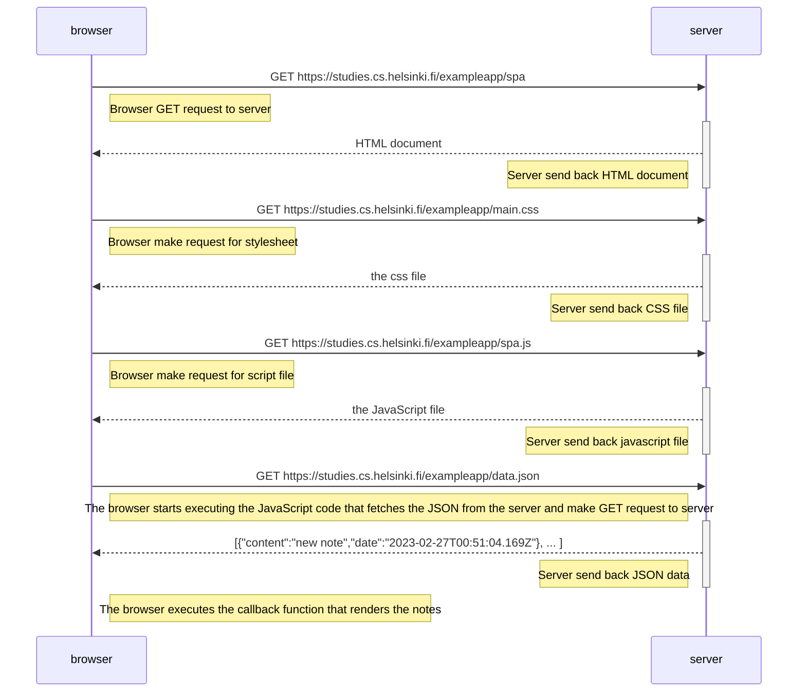

```mermaid
    sequenceDiagram
    participant browser
    participant server

    browser->>server: GET https://studies.cs.helsinki.fi/exampleapp/spa
    Note right of browser: Browser GET request to server

    activate server
    server-->>browser: HTML document
    Note left of server: Server send back HTML document
    deactivate server

    browser->>server: GET  https://studies.cs.helsinki.fi/exampleapp/main.css
    Note right of browser: Browser make request for stylesheet

    activate server
    server-->>browser: the css file
    Note left of server: Server send back CSS file
    deactivate server

    browser->>server: GET https://studies.cs.helsinki.fi/exampleapp/spa.js
    Note right of browser: Browser make request for script file

    activate server
    server-->>browser: the JavaScript file
    Note left of server: Server send back javascript file
    deactivate server


    browser->>server: GET https://studies.cs.helsinki.fi/exampleapp/data.json
    Note right of browser: The browser starts executing the JavaScript code that fetches the JSON from the server and make GET request to server

    activate server
    server-->>browser: [{"content":"new note","date":"2023-02-27T00:51:04.169Z"}, ... ]
    Note left of server: Server send back JSON data
    deactivate server

    Note right of browser: The browser executes the callback function that renders the notes


```
