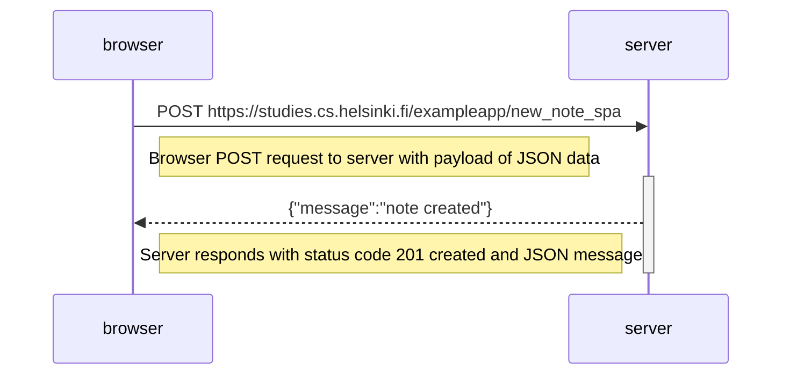

```mermaid
    sequenceDiagram
    participant browser
    participant server

    browser->>server: POST https://studies.cs.helsinki.fi/exampleapp/new_note_spa
    Note right of browser: Browser POST request to server with payload of JSON data

    activate server
    server-->>browser: {"message":"note created"}
    Note left of server: Server responds with status code 201 created and JSON message
    deactivate server


```
